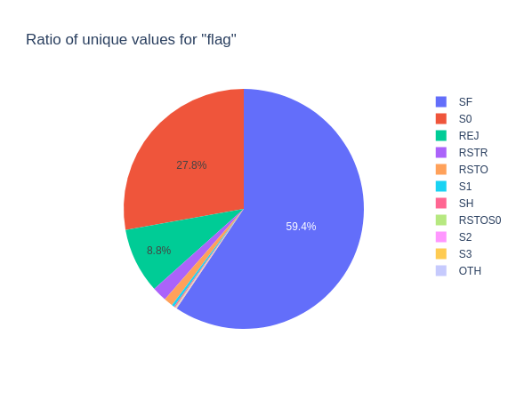

# Network Intrusion Detection

by Charaf-Eddine M'rah 

---

## 1-  Introduction

<!-- 
- Brief overview of the KDD Cup 1999 dataset and its purpose

- Overview of the project objectives and the machine learning models that were applied
-->

- The KDD Cup 1999 dataset is a widely used benchmark dataset in data mining and machine learning, containing 41 features and 494,021 instances.

- The purpose of the KDD Cup 1999 dataset is to evaluate the performance of algorithms for detecting network intrusions and other malicious activity.

---

### Objective of the Project

The objective of this project is to build a machine learning model that can accurately predict whether a network connection is malicious or benign.

---

### Machine Learning Models

The following machine learning models were applied:

- Logistic Regression
- K-Nearest Neighbors
- Random Forest
- Support Vector Machine

---

## 2 - Data Exploration and Preprocessing

<!-- 
- Description of the raw data and its format

- Steps taken to clean and prepare the data for analysis, such as handling missing values, scaling features, etc.

- Summary of key insights and observations from the initial data exploration 
-->

- The raw data is in the form of a CSV file with 494,021 rows and 42 columns.

---

- The dataset is balanced with 13449 normal connections and 11743 malicious connections.

---

---

---

---

The heatmap shows that there is a correlation between the following features:

- 

---

---

### Data splitting

- The dataset was split into a training set (80%) and a test set (20%).

- The "Test-dataset" is used to evaluate the final model.

---

## 3 - Models Training

<!-- 
- Description of the four machine learning models that were applied: (e.g. logistic regression, decision tree, random forest, neural network)

- Explanation of the evaluation criteria used to compare the models (e.g. accuracy, precision, recall)

- Results of the model comparison and selection of the best-performing model 
-->

- The four machine learning models that were applied are:

- Logistic Regression
- K-Nearest Neighbors
- Random Forest
- Support Vector Machine

---

## 4 - Model Evaluation

<!-- 
- Description of the final model's performance on the test set

- Comparison to baseline performance 
-->

---

## 5 - Summary

<!-- Summary of the key findings and results of the project
Next steps for the project. -->
