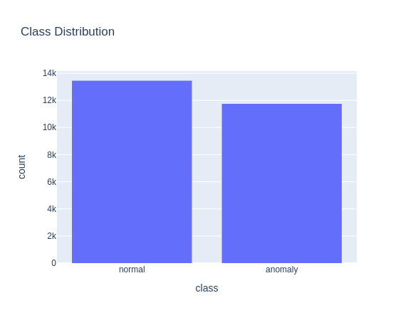
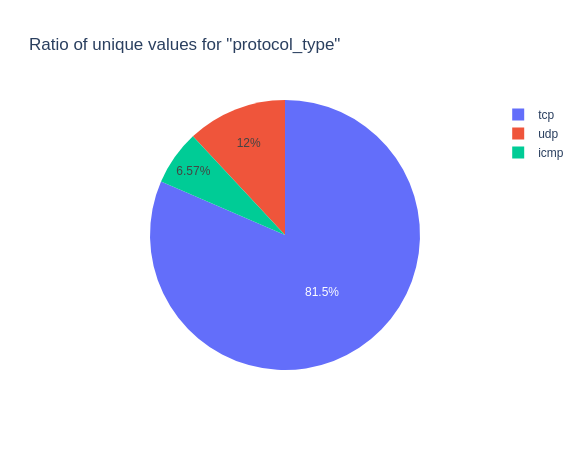
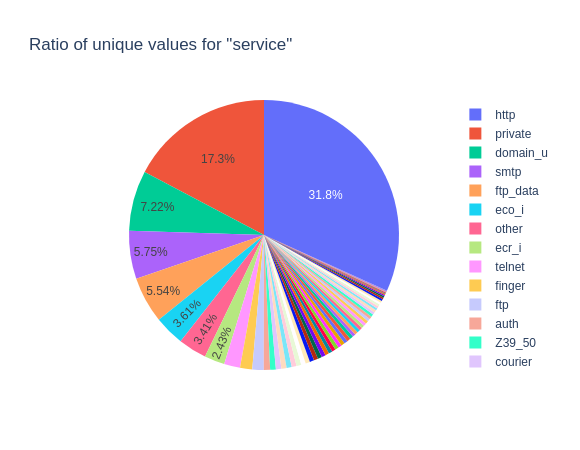
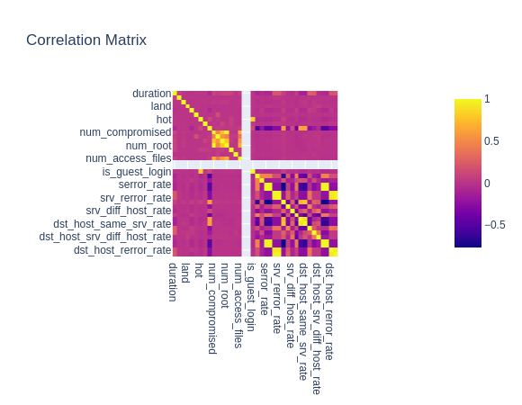
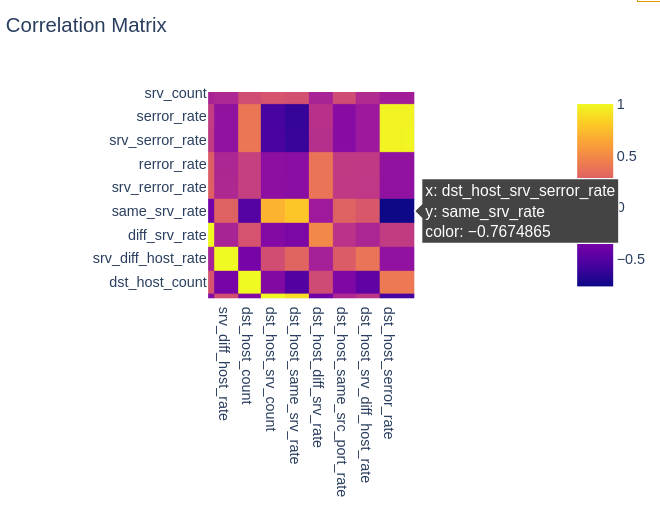
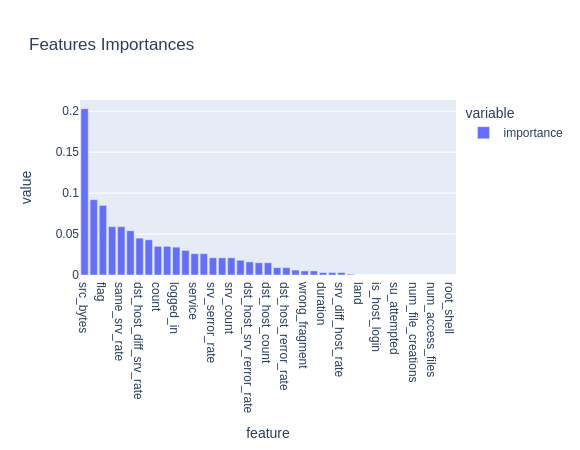
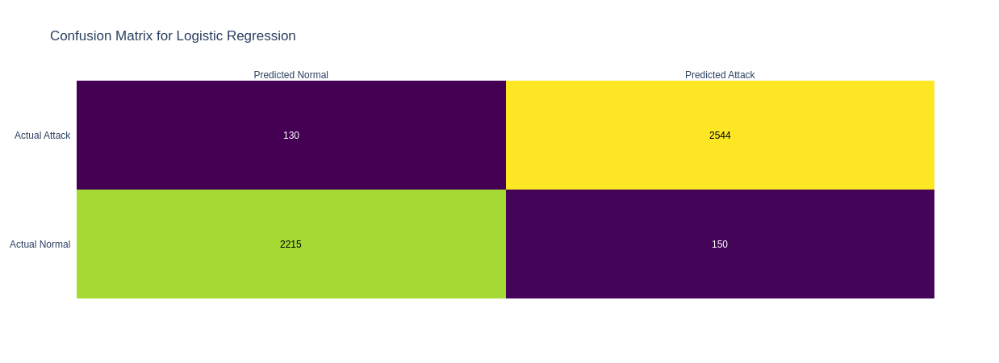
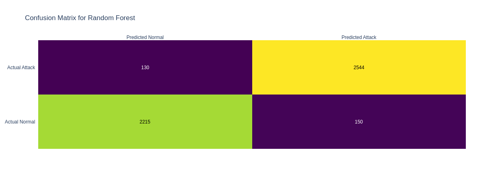
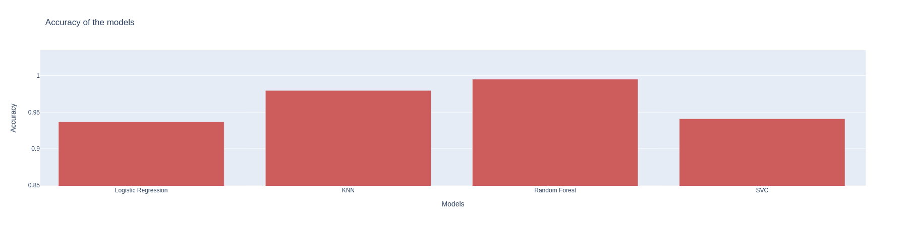

# Network Intrusion Detection

by Charaf-Eddine M'rah

---

## 1-  Introduction

<!-- 
- Brief overview of the KDD Cup 1999 dataset and its purpose

- Overview of the project objectives and the machine learning models that were applied
-->

---

### Objective of the Project

The main objective of this project is to build a machine learning model that can detect network intrusions and other malicious activity with high accuracy.

---

- The KDD Cup 99 dataset is a widely used benchmark dataset in data mining and machine learning, containing 41 features and 494,021 instances.

- The purpose of the KDD Cup 99 dataset is to evaluate the performance of algorithms for detecting network intrusions and other malicious activity.

---

### Machine Learning Models

The following machine learning models were applied:

- Logistic Regression
- K-Nearest Neighbors
- Random Forest
- Support Vector Machine

---

## 2 - Data Exploration and Preprocessing

<!-- 
- Description of the raw data and its format

- Steps taken to clean and prepare the data for analysis, such as handling missing values, scaling features, etc.

- Summary of key insights and observations from the initial data exploration 
-->

---

- The raw data is in the form of a CSV file with 494,021 rows and 42 columns.

---

- The dataset is balanced with 13449 normal connections and 11743 malicious connections.

---

---

---

---

- dst_host_srv_serror_rate: % of connections that have "SYN" errors
- same_srv_rate: % of connections to the same service

---

- Used Random Forest to determine the most important features.
- 11 features are selected based on their importance.

---

### Data splitting

- The dataset was split into a training set (80%) and a test set (20%).

- The test dataset is used to evaluate the final model.

---

## 3 - Models Training

<!-- 
- Description of the four machine learning models that were applied: (e.g. logistic regression, decision tree, random forest, neural network)

- Explanation of the evaluation criteria used to compare the models (e.g. accuracy, precision, recall)

- Results of the model comparison and selection of the best-performing model 
-->

---

The four machine learning models that were applied are:

- Logistic Regression
- K-Nearest Neighbors
- Random Forest
- Support Vector Machine

---

### Logistic Regression

Logistic regression is a statistical model that in its basic form uses a logistic function to model a binary dependent variable.

---

### K-Nearest Neighbors

K Nearest Neighbors is a non-parametric method used for classification and regression.

---

### Random Forest

Random forest is a supervised learning algorithm. It can be used both for classification and regression problems.

---

### Support Vector Machine

Support Vector Machine is a supervised machine learning algorithm which can be used for both classification or regression challenges.

---

## 4 - Model Evaluation

<!-- 
- Description of the final model's performance on the test set

- Comparison to baseline performance 
-->

---

---

---

---

---

- The confusion matrix for the Random Forest model and Logistic Regression model are equal.

- But does that mean they'll perform the same?

---

### Cross-Validation

- Used 10-fold cross-validation to evaluate the models.

---

### Key Insights

- The Random Forest model has the best performance with an accuracy of 99.5% and a false negative rate of 0.004%.

- Logistic Regression might be overfitting the data.

- The Support Vector Machine model has the worst performance with an accuracy of 91%.

---

---

## 5 - Summary

<!-- Summary of the key findings and results of the project
Next steps for the project. -->

- Machine learning models can be used to detect network intrusions and other malicious activity with high accuracy.
- The Random Forest model has the best performance with an accuracy of 99.5%.
- This is an alternative to the traditional signature-based detection methods.

---

## Thank You

Full code is available on GitHub

<https://github.com/charafmrah/network-intrusion-detection>
